sme-wsl小组数据库大作业

——前后端代码部分

项目后端主要以springboot为框架，前端使用thymeleaf渲染html，运用mysql数据库并连接、同步。

项目部署在阿里云服务器上并长久运行，可以使用<http://8.210.115.67:8080/>访问登录界面。

项目上传到github上（https://github.com/youdu6/sml-wsl）

一、整体框架

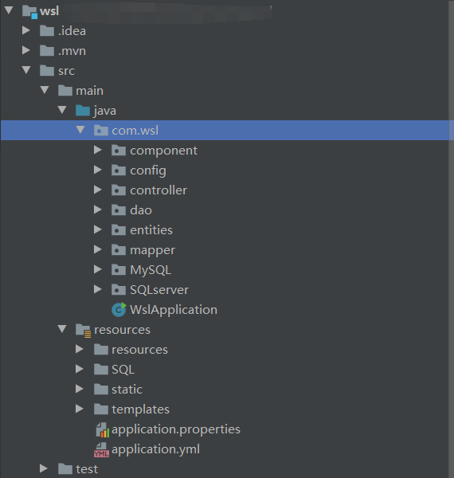

二、后端（java+springboot+mybatis+mysql）

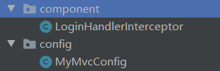

component与config为网站后端配置

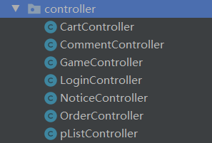

Controller包为网站后端配置（响应http），并完成一部分前端数据操作

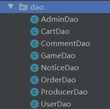

dao包为实体属性操作与后端数据库操作（增删改查等）

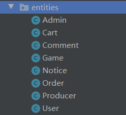

entities为实体包，完成实体属性与基本函数

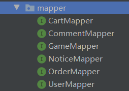

mapper包使用mybatis完成对mysql数据库的操作

为springboot项目启动类

三、前端（html+css+JavaScript+thymeleaf+webjar）

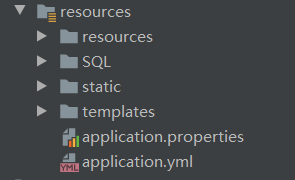

resources文件夹为非java代码，包括mysql，html，css，properties，yml，JavaScript，ico图片

为网页图片

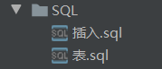

为mysql代码，包括建表与插入初始测试数据

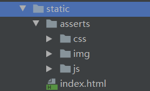

为网站前端样式，借用webjar的jquery与bootstrap样式

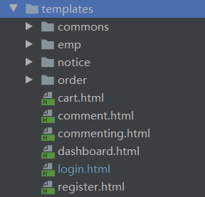

为网站前端html代码

为网站通用html，如侧边栏与顶部栏

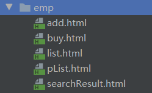

为游戏的前端操作，如增加、购买、（生产商与用户）游戏列表、搜索列表

为公告前端界面

为订单前端

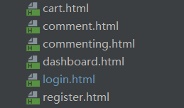

分别为购物车、评论列表、评论、主页、登录与注册页面

为配置文件，包括springboot配置与远程mysql数据库连接

四、测试

test包主要为测试数据库连接

五、依赖

为springboot依赖配置
